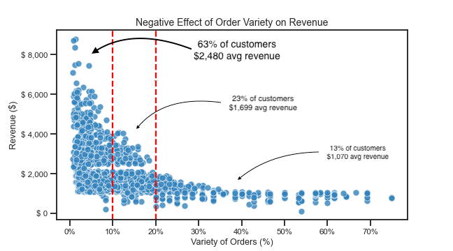

# Machine Learning in Business

> Note this README is still a work-in-progress

Capstone Project of a MSc. in Business Analytics. 

Apprentice Chef is a hypothetical company with a unique spin on cooking at home. Developed for the busy professional that has little to no skills in the kitchen, they offer a wide selection of daily-prepared gourmet meals delivered directly to your door. Executives at Apprentice Chef are interested in predicting: 
- How much revenue they could expect from each customer within their first year of using Apprentice Chef services
- Which customers will subscribe to the *"Halfway There"* service, a cross-selling promotion

  
## Part 1 - Exploration (EDA)

- Conduct EDA on response & explanatory variables
- Identify variables that require transformations
- Feature engineering

  
## Part 2 - Revenue Prediction

- Build & compare 4 models:

  1. Ordinary Least Squares (OLS) Regression
  2. Lasso Regression
  3. Bayesian Automatic Relevance Determionation (ARD)
  4. K Nearest Neighbors (KNN)

  
## Part 3 - Cross-sell Classification

- Build, tune hyperparameters, & compare 4 models:

  1. Logistic Regression
  2. Decision Tree
  3. Random Forest
  4. Gradient Boosted Machines (GBM)

  
## Part 4 - Report to Management

### Situation
Executives at Apprentice Chef want to understand how much revenue to expect from customers within their first year, and which customers are likely to subscribe to the newly launched *Halfway There* service.

### Revenue Insight
> **R-Square: 0.771**
>
> **Variety of orders** is a strong predictor of customer revenue. It's percentage of how many unique purchases a customer makes in relation to the total number of meal they order. This variable **negatively correlates** with revenue by **-0.45**. This negative relationship is depicted in the scatterplot below.
>
> Approximately 63\% of customers with **less than 10% variety** in their orders have an **average of \\$2,480 revenue**. This is **\\$800 to \$1,500 more revenue on average** in comparison to the other 37\% of customers who have more than 10\% variety in their orders.
> 
> 
> 
>
> **Recommendation**: Developing more unique meal-sets will not translate into more revenue or serve the majority of our customers. Resources spent on developing more unique meal-kits should be reduced or transferred to other value creating activities such as marketing, operations, or improving the mobile platform.

### Cross-selling Insight
> **AUC: 0.886** 
> 
> **Busy professionals** are one of the strongest predictors of cross-selling success. These are customers who have provided their mobile number OR have signed into the mobile platform more than other customers on average. These customers also have a professional email domain as classified by the marketing team.
> 
> - Busy professionals make up **33\%** of the sample analyzed and has the highest **positive correlation** of **0.2** with *Halfway There*. 
> - **60\%** of this segment has made order cancellations before noon - which has a **0.16 positive correlation** with cross-selling success. 
> - **84\%** of busy professionals who canceled orders before noon subscribed to *Halfway There*.
> 
> 
> **Recommendation**: Promote *Halfway There* to *busy professionals* through the mobile platform using either a pop-up ad or through a conversation with a customer service agent and do so at the touchpoint of after they've canceled an order before or after noon.

### Conlusion
> - Reduce resources on developing more unique meal-kits or transfer to other business activities.
> - Cross-sell to busy professionals through the mobile platform when they're canceling their meal orders before or after noon.

